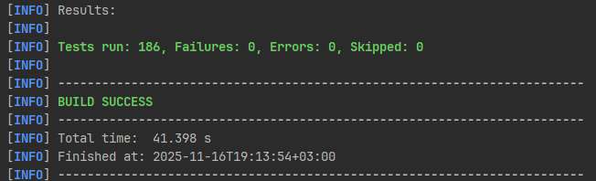

# OrmExam - Система управления онлайн-обучением и тестированием

### Архитектурные слои:
- **Controllers** — REST API endpoints
- **DTO** - Data Transfer objects (request, response, nested)
- **Entities** — Модели данных (JPA сущности + валидация)
- **Exceptions** - Кастомные ошибки
- **Mapper** - мапперы для преобразования сущностей в request и response
- **Repositories** — Доступ к данным (Spring Data JPA)
- **Services** — Бизнес-логика приложения (транзакции)
- **Resources** — Конфигурация и миграции БД (Liquibase)

---

### Используемые переменные окружения:
```shell
# Настройки БД:
DB_HOST=localhost           # Хост БД (по умолчанию: localhost)
DB_PORT=5432                # Порт БД (по умолчанию: 5432)
DB_NAME=orm_exam            # Имя БД (по умолчанию: orm_exam)
DB_USERNAME=postgres        # Пользователь БД (по умолчанию: postgres)
DB_PASSWORD=postgres        # Пароль БД (по умолчанию: postgres)

# Приложение:
SPRING_PROFILES_ACTIVE=dev  # Активный профиль (по умолчанию: dev)

## Maven профили и команды для сборки

### Профили:

- test - для тестов (testcontainers)
- testh2 - для тество (H2)
- dev - для разработки (PostgreSQL)


### 1. Cборка:

- **ТЕСТОВАЯ**
    * Без тестов / с тестами (профиль test)*
      ```shell
      mvn clean install -P testh2 -DskipTests
      ```
      ```shell
      mvn clean install -P test
      ```
- **РАЗРАБОТКА**
    * Дефолтная сборка без тестов / с тестами*

      ```shell
      mvn clean install -DskipTests
      ```
      ```shell
      mvn clean install
      ```
- **ТОЛЬКО ТЕСТЫ**
    * Только unit + интеграционные тесты (профиль test / dev)*

      ```shell
      mvn test -P test
      ```
      ```shell
      mvn test
      ```
- **БЫСТРАЯ СБОРКА**
* Полное отключение тестов
    * Для PowerShell:
  ```shell
  mvn clean install -P prod "-Dmaven.test.skip=true"
  ```


### Результат тестов:

### Развернуть приложение в Docker контейнере
#### Собираем
```shell
mvn clean install -P prod -DskipTests
```
#### Разворачиваем
```shell
docker-compose up -d
```

## API Endpoints

### Пользователи

- `GET /api/v1/users` — Получить всех пользователей
- `GET /api/v1/users/{id}` — Получить пользователя по ID
- `POST /api/v1/users` — Создать пользователя
- `PUT /api/v1/users/{id}` — Обновить пользователя
- `DELETE /api/v1/users/{id}` — Удалить пользователя

### Категории

- `GET /api/v1/categories` — Получить все категории
- `GET /api/v1/categories/{id}` — Получить категорию по ID
- `POST /api/v1/categories` — Создать категорию
- `PUT /api/v1/categories/{id}` — Обновить категорию
- `DELETE /api/v1/categories/{id}` — Удалить категорию

### Курсы

- `GET /api/v1/courses` — Получить все курсы
- `GET /api/v1/courses/{id}` — Получить курс по ID
- `GET /api/v1/courses/user/{userId}` — Получить курсы пользователя
- `GET /api/v1/courses/{id}/students` — Получить список пользователей, записанных на курс
- `POST /api/v1/courses` — Создать курс
- `PUT /api/v1/courses/{id}` — Обновить курс
- `DELETE /api/v1/courses/{id}` — Удалить курс

### Записи на курсы

- `GET /api/v1/enrollments` — Получить все записи
- `POST /api/v1/enrollments/enroll?userId={userId}&courseId={courseId}` — Создать запись на курс
- `POST /api/v1/enrollments/unenroll?userId={userId}&courseId={courseId}` — Удалить запись

### Модули курсов

- `GET /api/v1/modules` — Получить все модули
- `GET /api/v1/modules/{id}` — Получить модуль по ID
- `POST /api/v1/modules` — Создать модуль
- `PUT /api/v1/modules/{id}` — Обновить модуль
- `DELETE /api/v1/modules/{id}` — Удалить модуль

### Уроки

- `GET /api/v1/lessons` — Получить все уроки
- `GET /api/v1/lessons/{id}` — Получить урок по ID
- `POST /api/v1/lessons` — Создать урок
- `PUT /api/v1/lessons/{id}` — Обновить урок
- `DELETE /api/v1/lessons/{id}` — Удалить урок

### Задания

- `GET /api/v1/assignments` — Получить все задания
- `GET /api/v1/assignments/{id}` — Получить задание по ID
- `POST /api/v1/assignments` — Создать задание
- `PUT /api/v1/assignments/{id}` — Обновить задание
- `DELETE /api/v1/assignments/{id}` — Удалить задание


### Отправки работ

- `GET /api/v1/submissions` — Получить все отправки работ
- `GET /api/v1/submissions/{id}` — Получить отправку по ID
- `GET /api/v1/submissions/assignment/{assignmentId}` — Получить отправки по заданию
- `GET /api/v1/submissions/student/{studentId}` — Получить отправки студента
- `POST /api/v1/submissions/submit?assignmentId={assignmentId}&studentId={studentId}` — Создать отправку работы
- `PUT /api/v1/submissions/{id}` — Обновить отправку
- `DELETE /api/v1/submissions/{id}` — Удалить отправку

### Тесты

- `POST /api/v1/quizzes/{id}/take?studentId={studentId}` - пройти тест
- `GET /api/v1/quizzes` — Получить все тесты
- `GET /api/v1/quizzes/{id}` — Получить тест по ID
- `POST /api/v1/quizzes` — Создать тест
- `PUT /api/v1/quizzes/{id}` — Обновить тест
- `DELETE /api/v1/quizzes/{id}` — Удалить тест

### Вопросы

- `GET /api/v1/questions` — Получить все вопросы
- `GET /api/v1/questions/{id}` — Получить вопрос по ID
- `POST /api/v1/questions` — Создать вопрос
- `PUT /api/v1/questions/{id}` — Обновить вопрос
- `DELETE /api/v1/questions/{id}` — Удалить вопрос

### Варианты ответов

- `GET /api/v1/answer-options` — Получить все варианты ответов
- `GET /api/v1/answer-options/{id}` — Получить вариант ответа по ID
- `GET /api/v1/answer-options/question/{questionId}` — Получить варианты ответов вопроса
- `POST /api/v1/answer-options` — Создать вариант ответа
- `PUT /api/v1/answer-options/{id}` — Обновить вариант ответа
- `DELETE /api/v1/answer-options/{id}` — Удалить вариант ответа

### Результаты тестов

- `GET /api/quiz-submissions` - Получить все результаты тестов
- `GET /api/quiz-submissions/{id}` - Получить результат теста по ID
- `GET /api/quiz-submissions/student/{studentId}` - Получить результаты тестов студента
- `GET /api/quiz-submissions/course/{courseId}` - Получить результаты всех тестов по курсу
- `GET /api/quiz-submissions/module/{moduleId}` - Получить результаты всех тестов по модулю
- `POST /api/quiz-submissions/submit?quizId={quizId}&studentId={studentId}&score={score}` - Создать результат теста
- `PUT /api/quiz-submissions/{id}` - Обновить результат теста
- `DELETE /api/quiz-submissions/{id}` - Удалить результат теста

### Профили
- `GET /api/v1/profiles/{id}` - Получить профиль по id
- `POST /api/v1/profiles` - Создать профиль
- `PUT /api/v1/profiles/{id}` - Обновить профиль
- 
### Теги

- `GET /api/v1/tags` — Получить все тэги
- `GET /api/v1/tags/{id}` — Получить тэг по ID
- `POST /api/v1/tags` — Создать тэг
- `PUT /api/v1/tags/{id}` — Обновить тэг
- `DELETE /api/v1/tags/{id}` — Удалить тэг

### Отзывы о курсах

- `GET /api/v1/course-reviews` — Получить все отзывы
- `GET /api/v1/course-reviews/{id}` — Получить отзыв по ID
- `POST /api/v1/course-reviews` — Создать отзыв
- `PUT /api/v1/course-reviews/{id}` — Обновить отзыв
- `DELETE /api/v1/course-reviews/{id}` — Удалить отзыв

## Структура проекта
```markdown
OrmExam/
├── src/
│   ├── main/
│   │   ├── java/sf/mephy/study/orm_exam/
│   │   │   ├── controller/       # REST контроллеры
│   │   │   ├── dto/       # DTO для сущностей
│   │   │   ├── entity/           # Сущности БД
│   │   │   │   ├── User.java       # Пользователи
│   │   │   │   ├── Course.java     # Курсы
│   │   │   │   ├── Category.java   # Категории
│   │   │   │   ├── Module.java      # Модули курсов
│   │   │   │   ├── Lesson.java      # Уроки
│   │   │   │   ├── Assignment.java  # Задания
│   │   │   │   ├── Submission.java  # Отправки работ
│   │   │   │   ├── Profile.java  # Профили
│   │   │   │   ├── Quiz.java        # Тесты
│   │   │   │   ├── Question.java    # Вопросы
│   │   │   │   ├── AnswerOption.java# Варианты ответов
│   │   │   │   ├── QuizSubmission.java # Отправки тестов
│   │   │   │   ├── Enrollment.java  # Записи на курсы
│   │   │   │   ├── CourseReview.java # Отзывы
│   │   │   │   └── Tag.java         # Теги
│   │   │   ├── repository/       # Репозитории Spring Data JPA
│   │   │   ├── service/            # Бизнес-логика
│   │   │   ├── exception/          # Обработка ошибок
│   │   │   └── mapper/              # Мапперы для сущностей и DTO
│   │   └── resources/
│   │       ├── application.yml      # Основная конфигурация
│   │       ├── application-dev.yml  # Конфиг для разработки
│   │       ├── application-test.yml # Конфиг для тестирования
│   │       ├── application-testh2.yml # Конфиг для тестирования c бд H2
│   │       └── db/ # Миграции Liquibase
│   └── test/
│       └── java/sf/mephy/study/orm_exam/ # Тесты
├── docker-compose.yml               # Docker Compose для запуска
├── Dockerfile                       # Конфигурация Docker образа
├── pom.xml                          # Maven конфигурация
├── ORM Exam.postman_collection.json # Коллекция Postman для тестирования
└── README.md                        # Документация проекта
```